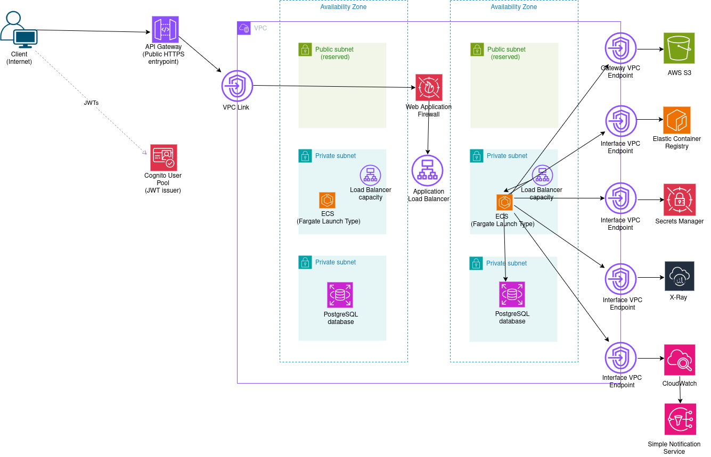

# Architecture 3: Deployed on ECS using the Fargate launch type.

This application is deployed on AWS using ECS, with Fargate Launch Type.

## Architecture

Full explanation: [docs/00-architecture.md](docs/00-architecture.md)

## Features
- Secure authentication with JWT (Cognito)
- Private backend (no public ECS tasks)
- Multi-AZ deployment
- Auto scaling (CPU + memory)
- Deployment safety (circuit breaker + rollback)
- Health checks (liveness + readiness)
- Structured logging
- Distributed tracing (OpenTelemetry → ADOT → X-Ray)
- Web Application Firewall (WAF)
- No NAT Gateway (cost-efficient via VPC endpoints)

## Tech stack

### Backend
- Java / Spring Boot
- Spring Security (OAuth2 Resource Server)
- JPA / Hibernate
- Flyway (database migrations)

### Infrastructure
- AWS CDK (TypeScript)
- Amazon ECS (Fargate launch type)
- Amazon RDS (PostgreSQL)
- Amazon API Gateway (HTTP API)
- Amazon Cognito
- Amazon CloudWatch (logs, metrics, alarms)
- AWS X-Ray (tracing via ADOT)

## Deployment procedure

Deployment procedure can be found [here](docs/01-deployment.md) .

## Testing procedure

Testing procedure can be found [here](docs/01-deployment.md) .

## OpenAPI / Swagger paths

- Swagger UI: /swagger-ui.html
- OpenAPI JSON: /v3/api-docs

## Observability
The system includes:
- Logs
    - Application logs (CloudWatch)
    - ECS / system logs
    - ALB access logs (S3)
- Metrics
    - ECS CPU / memory
    - ALB metrics
- Alarms
    - ALB 5xx errors
    - Unhealthy targets
- Tracing
    - OpenTelemetry instrumentation
    - ADOT collector sidecar
    - Export to AWS X-Ray

## Security
- Private subnets for ECS and RDS
- Internal ALB (not internet-facing)
- IAM roles for least-privilege access
- Secrets stored in AWS Secrets Manager
- JWT authentication with Cognito
- WAF protection on ALB

## Design Highlights
- Fargate instead of ECS EC2
    - Less infrastructure management
- HTTP API instead of REST API
    - Lower cost and latency
    - Simpler configuration
- No NAT Gateway
    - Reduced cost
    - Uses VPC interface endpoints instead
- ADOT + X-Ray for tracing
    - Lightweight observability for demo
    - Production-ready foundation

## Future Improvements
- CI/CD pipeline (GitHub Actions)
- Environment separation (dev/staging/prod)
- Custom domain + TLS
- Advanced WAF rules
- External APM (Datadog / New Relic)
- Cost optimization and task sizing tuning
