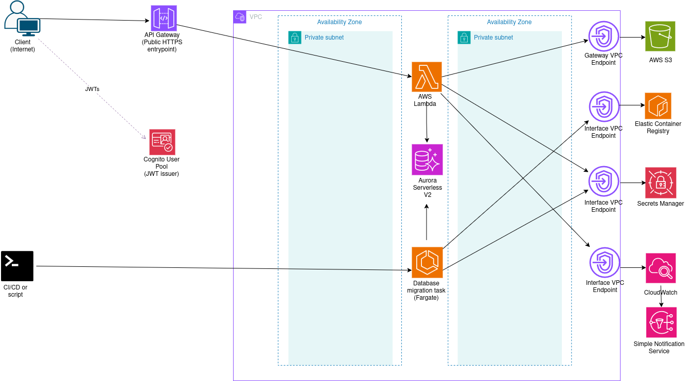

# Architecture 4: Serverless architecture.

This application is deployed on AWS using AWS Lambda, with an Aurora Serverless v2 database.

## Architecture

Full explanation: [docs/00-architecture.md](docs/00-architecture.md)

## Features
- Secure authentication with JWT using Amazon Cognito
- Serverless Java 21 API backend using AWS Lambda
- API Gateway HTTP API with Cognito JWT authorizer
- Private database access from Lambda through VPC-isolated networking
- Aurora PostgreSQL Serverless v2 database deployed in private isolated subnets
- RDS Proxy for database connection management and connection reuse
- Database credentials managed securely with AWS Secrets Manager
- Multi-AZ private subnet layout
- No NAT Gateway; private AWS service access through VPC endpoints
- Flyway database migrations executed as ECS Fargate one-off tasks
- Lambda reserved concurrency to protect the database layer from traffic spikes
- Aurora Serverless v2 capacity scaling
- SnapStart enabled for published Java Lambda versions
- CloudWatch logs, API Gateway access logs, metrics, and alarms
- Infrastructure as Code with AWS CDK

## Tech stack

### Backend

- Java 21
- AWS Lambda Java runtime
- API Gateway HTTP API event handling
- Lightweight custom routing layer
- Service and repository layers
- JDBC with PostgreSQL driver
- Jackson for JSON serialization/deserialization
- AWS SDK for Java v2 for Secrets Manager integration
- Flyway for database migrations

### Infrastructure

- AWS CDK with TypeScript
- AWS Lambda for the Orders API backend
- Amazon API Gateway HTTP API
- Amazon Cognito User Pool for JWT authentication
- Amazon Aurora PostgreSQL Serverless v2
- Amazon RDS Proxy for database connection management
- AWS Secrets Manager for database credentials
- Amazon ECS on AWS Fargate for one-off Flyway migration tasks
- Amazon VPC with private isolated subnets
- VPC endpoints for private AWS service access without a NAT Gateway
- Amazon CloudWatch for logs, metrics, alarms, and API access logs

## Deployment procedure

Deployment procedure can be found [here](docs/01-deployment.md) .

## Testing procedure

Testing procedure can be found [here](docs/01-deployment.md) .

## API overview

The application exposes a Cognito-protected Orders API through API Gateway HTTP API.

| Method | Path                  | Description                                |
|--------|-----------------------|--------------------------------------------|
| `POST` | `/orders`             | Create a new order                         |
| `GET`  | `/orders`             | List orders, optionally filtered by status |
| `GET`  | `/orders/{id}`        | Retrieve an order by ID                    |
| `PUT`  | `/orders/{id}/cancel` | Cancel an order idempotently               |

For request and response examples, see [API documentation](docs/02-api.md).

## Observability

The system includes observability for the API, Lambda backend, database layer, and migration tasks.

### Logs

- Lambda application logs in Amazon CloudWatch Logs
- API Gateway HTTP API access logs in Amazon CloudWatch Logs
- ECS Fargate migration task logs in Amazon CloudWatch Logs
- Flyway migration output captured through ECS task logging

### Metrics

- Lambda metrics:
    - Errors
    - Throttles
    - Duration
    - Concurrent executions
- API Gateway HTTP API metrics:
    - Request count
    - 4xx errors
    - 5xx errors
    - Latency
    - Integration latency
- RDS Proxy metrics:
    - Client connections
    - Database connection borrow latency
    - Database connection borrow timeouts
- Aurora PostgreSQL metrics:
    - CPU utilization
    - ACU utilization
    - Database connections
    - Freeable memory
    - Deadlocks
    - Replica lag
- ECS migration task metrics through ECS Container Insights

### Alarms

- Lambda errors
- Lambda throttles
- Lambda p95 duration
- Lambda concurrent executions near the reserved concurrency limit
- API Gateway 4xx error rate
- API Gateway 5xx error rate
- API Gateway p95 latency
- API Gateway integration p95 latency
- RDS Proxy connection borrow timeouts
- RDS Proxy connection borrow latency
- RDS Proxy client connections
- Aurora CPU utilization
- Aurora ACU utilization
- Aurora database connections
- Aurora deadlocks
- Aurora low freeable memory
- Aurora replica lag
- Failed ECS migration tasks

## Security

- JWT-based authentication using Amazon Cognito
- API Gateway HTTP API protected with a Cognito user pool authorizer
- Lambda function deployed inside private isolated subnets
- Aurora PostgreSQL database deployed in private isolated subnets
- Database access routed through Amazon RDS Proxy
- Security groups restrict database traffic: 
  - Lambda can connect to RDS Proxy on PostgreSQL port `5432`
  - Migration ECS tasks can connect to RDS Proxy on PostgreSQL port `5432`
  - RDS Proxy can connect to Aurora on PostgreSQL port `5432`
- Database credentials stored in AWS Secrets Manager
- Lambda and migration task roles are granted access to the database secret
- TLS required for RDS Proxy connections
- No public database access
- No NAT Gateway; private AWS service access is provided through VPC endpoints

## Design Highlights

- Serverless API backend with AWS Lambda
  - No application servers to manage
  - Scales automatically with incoming API traffic
  - Fits the small, event-driven Orders API workload

- Java 21 Lambda runtime with SnapStart
  - Keeps the backend implementation type-safe and familiar
  - SnapStart is enabled for published versions to improve Java cold-start behavior

- API Gateway HTTP API instead of REST API
  - Lower-cost and simpler option for HTTP-based APIs
  - Native integration with Lambda
  - Supports Cognito JWT authorization

- Cognito-based JWT authentication
  - API Gateway validates tokens before invoking Lambda
  - Keeps authentication outside the application code
  - The Lambda handler can focus on request routing and business logic

- Aurora PostgreSQL Serverless v2
  - Provides a managed relational database with PostgreSQL compatibility
  - Capacity can scale within the configured ACU range
  - Suitable for practicing relational database patterns on AWS

- RDS Proxy between Lambda and Aurora
  - Helps manage database connections from concurrent Lambda invocations
  - Reduces pressure on the Aurora database during traffic spikes
  - Centralizes database connectivity through a dedicated proxy layer

- Secrets Manager for database credentials
  - Keeps database credentials out of source code and environment variables
  - Lambda and migration tasks receive permission to read the database secret
  - Application code caches credentials briefly to reduce repeated secret lookups

- Private isolated subnet architecture
  - Lambda, RDS Proxy, Aurora, and migration tasks run in private isolated subnets
  - Aurora is not publicly accessible
  - Security groups restrict traffic between Lambda, migration tasks, RDS Proxy, and Aurora

- No NAT Gateway
  - Reduces baseline networking cost
  - Private access to AWS services is provided through VPC endpoints
  - Fits the isolated backend architecture of the project

- ECS Fargate for one-off database migrations
  - Runs Flyway migrations inside the same private VPC as the database
  - Avoids running migrations manually from a developer machine
  - Keeps migration tooling separate from the Lambda application package

- CDK stack separation
  - Infrastructure is split into focused stacks: network, database, migration, Lambda, Cognito, API, and monitoring
  - Makes deployment order and dependencies easier to understand
  - Helps document the role of each infrastructure layer

- Lambda reserved concurrency
  - Limits maximum concurrent Lambda executions
  - Protects the database and RDS Proxy from uncontrolled traffic spikes
  - Provides a simple back-pressure mechanism for a database-backed Lambda API

- CloudWatch-based observability
  - Lambda logs, API Gateway access logs, and migration logs are centralized in CloudWatch Logs
  - Alarms cover Lambda, API Gateway, RDS Proxy, Aurora, and migration failures
  - Provides operational visibility without adding extra observability tooling

## Future Improvements

- CI/CD pipeline
  - Build and test the Java Lambda application automatically
  - Run CDK synth/diff checks on pull requests
  - Deploy infrastructure through GitHub Actions or another CI/CD system

- Safer production removal policies
  - Replace development-friendly `RemovalPolicy.DESTROY` with `RemovalPolicy.RETAIN` for critical resources
  - Enable deletion protection for Aurora
  - Define a documented backup and restore process

- Lambda deployment safety
  - Add canary or linear deployments using Lambda aliases
  - Add automatic rollback based on CloudWatch alarms
  - Run smoke tests after deployment

- Custom domain and TLS
  - Add a custom domain for API Gateway
  - Use AWS Certificate Manager for TLS certificates
  - Configure a cleaner public API URL

- Distributed tracing
  - Enable AWS X-Ray tracing for Lambda and API Gateway
  - Consider OpenTelemetry instrumentation if deeper tracing is needed
  - Propagate correlation IDs through logs and responses

- Stronger API protection
  - Add AWS WAF in front of API Gateway
  - Add rate limiting or throttling rules
  - Add usage plans or API keys if exposing the API to external consumers

- More complete security hardening
  - Review IAM permissions for least privilege
  - Add stricter Cognito password and account recovery policies
  - Consider IAM authentication for RDS Proxy
  - Add secret rotation for database credentials

- Resilience and availability improvements
  - Add Aurora reader instances for faster failover and read scalability
  - Tune Aurora Serverless v2 min/max ACU values based on observed load
  - Add documented recovery procedures for failed migrations and database issues

- Performance and cost tuning
  - Tune Lambda memory size and timeout based on real metrics
  - Tune reserved concurrency based on database capacity
  - Review VPC endpoint costs versus NAT Gateway trade-offs for larger workloads
  - Tune Aurora Serverless v2 capacity limits

- Operational runbooks
  - Document how to investigate Lambda errors, API 5xx responses, and migration failures
  - Document how to rotate secrets
  - Document how to restore the database from backups
  - Document how to safely destroy the development environment
