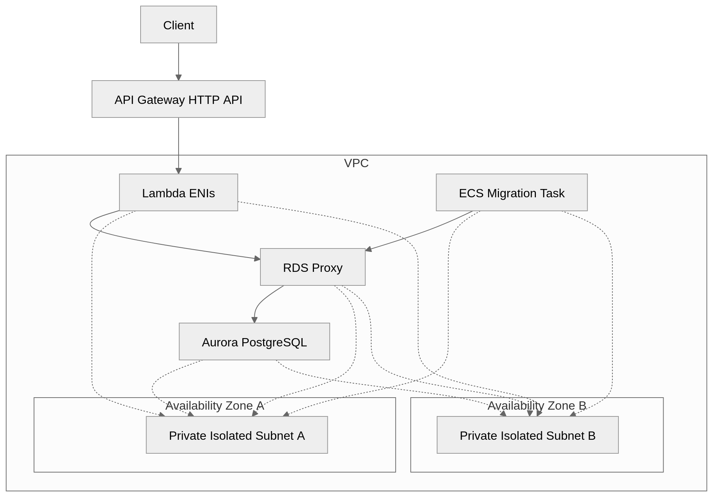
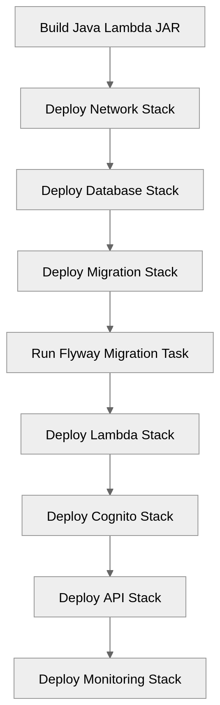

# Architecture

This project is a serverless Orders API built on AWS. It exposes a small REST-style API for creating, listing, retrieving, and cancelling orders.

The backend application is implemented in Java 21 and deployed as an AWS Lambda function. The infrastructure is defined using AWS CDK in TypeScript.

## High-level overview

At a high level, the system consists of:

- a public API endpoint exposed by API Gateway HTTP API;
- a Cognito User Pool used for JWT authentication;
- a Java Lambda function handling Orders API requests;
- an Aurora PostgreSQL Serverless v2 database;
- an RDS Proxy between Lambda and Aurora;
- Secrets Manager for database credentials;
- an ECS Fargate task used to run Flyway database migrations;
- CloudWatch logs, metrics, and alarms for observability.

## Request flow

### Authentication Flow
1. The client authenticates with Amazon Cognito.
2. Cognito returns a JWT access token.
3. The client includes the token in requests:

   `Authorization: Bearer <JWT>`

### API Request Flow
1. The client calls API Gateway and passes the token in the `Authorization` header.
2. API Gateway validates the JWT using the Cognito authorizer.
3. If the token is valid, API Gateway invokes the Java Lambda function.
4. The Lambda function converts the API Gateway event into an internal HTTP request model.
5. The in-application router dispatches the request to the appropriate service method.
6. The service layer applies business rules.
7. The repository layer executes SQL against Aurora PostgreSQL through RDS Proxy.
8. The Lambda function returns a JSON response through API Gateway.

### Observability Flow
- Application logs → CloudWatch Logs
- Infrastructure metrics → CloudWatch
- API Gateway access logs → S3

## Runtime architecture diagram


## Main Runtime Components

### API Gateway HTTP API
Amazon API Gateway HTTP API is the public entry point for the application.

It is responsible for:
- exposing the Orders API endpoints;
- receiving client HTTP requests;
- validating Cognito JWT tokens;
- invoking the Lambda backend;
- writing structured access logs to CloudWatch Logs.

The API uses a Cognito user pool authorizer, so unauthenticated requests are rejected before reaching the Lambda function.

The API routes are configured as catch-all routes and the Java Lambda application performs the internal routing.

### Amazon Cognito

Amazon Cognito provides authentication for the API.

The project uses:
- a Cognito User Pool;
- a User Pool Client;
- JWT-based authentication;
- API Gateway Cognito authorizer integration.

Users are created by the account owner. Self sign-up is disabled.

The Lambda application does not validate JWTs directly. Token validation happens at the API Gateway layer.

### AWS Lambda

The Orders API backend is implemented as a Java 21 AWS Lambda function.

The Lambda function is responsible for:
- receiving API Gateway HTTP API events;
- adapting API Gateway events into internal request objects;
- routing requests to the correct handler logic;
- applying business rules through the service layer;
- accessing the database through the repository layer;
- returning API Gateway-compatible HTTP responses.

The Lambda function runs inside private isolated subnets in the VPC. This allows it to access RDS Proxy privately while keeping the database layer inaccessible from the public internet.

SnapStart is enabled for published Lambda versions to improve Java cold-start behavior.

Reserved concurrency is configured to protect the database layer from uncontrolled traffic spikes.

### Amazon Aurora PostgreSQL Serverless v2

Aurora PostgreSQL Serverless v2 is used as the relational database for the application.

The database stores order records in the orders table.

Aurora is deployed in private isolated subnets and is not publicly accessible.

The current configuration is development-friendly. Production environments should use stronger retention and deletion protection settings.

### Amazon RDS Proxy

RDS Proxy sits between the Lambda function and Aurora PostgreSQL.

It is used to:
- manage database connections from Lambda;
- reduce the impact of Lambda concurrency on Aurora;
- provide a stable database endpoint for the application;
- integrate with Secrets Manager for database credentials.

The Lambda function connects to the RDS Proxy endpoint instead of connecting directly to Aurora.

This is especially useful for Lambda-based applications because Lambda can scale horizontally and create many concurrent execution environments.

### AWS Secrets Manager

Database credentials are stored in AWS Secrets Manager.

The Aurora database credentials are generated and stored as a secret. The Lambda function and the migration task are granted permission to read this secret.

The Java application reads credentials from Secrets Manager through the AWS SDK and caches them briefly in memory. If a database authentication failure occurs, the application refreshes the cached credentials and retries the connection.

This avoids hardcoding database passwords in source code or configuration files.

### ECS Fargate

Database migrations are executed using Flyway inside an ECS Fargate one-off task.

The migration task:
- runs inside the same private VPC as the database;
- connects to Aurora through RDS Proxy;
- reads database credentials from Secrets Manager;
- executes SQL migration files using Flyway;
- writes migration logs to CloudWatch Logs.

This keeps migration tooling separate from the Lambda runtime package and avoids running database migrations manually from a developer machine.

## Application Architecture

The Java Lambda application is structured into small layers.

```
OrdersApiHandler
  -> ApiGatewayV2HttpAdapter
  -> Router
  -> OrderService
  -> OrderRepository
  -> DataSource / RDS Proxy / Aurora
```

### Handler Layer

The `OrdersApiHandler` class is the Lambda entry point.

It implements the `RequestHandler<APIGatewayV2HTTPEvent, APIGatewayV2HTTPResponse>` interface.

Its responsibilities are:
- receive the Lambda invocation event;
- convert the event into an internal HTTP request;
- delegate routing to the Router;
- convert the internal HTTP response back into an API Gateway response;
- handle unexpected errors safely.

### Adapter Layer

The `ApiGatewayV2HttpAdapter` converts between AWS-specific API Gateway objects and application-specific HTTP DTOs.

It handles:
- HTTP method extraction;
- path extraction;
- query string extraction;
- plain and Base64-encoded request bodies;
- JSON serialization of response bodies.

This keeps most of the application independent from API Gateway-specific classes.

### Routing Layer

The `Router` performs lightweight in-application routing.

It supports the following endpoints:

| Method | Path                  | Description             |
|--------|-----------------------|-------------------------|
| `POST` | `/orders`             | Create a new order      |
| `GET`  | `/orders`             | List orders             |
| `GET`  | `/orders/{id}`        | Retrieve an order by ID |
| `PUT`  | `/orders/{id}/cancel` | Cancel an order         |

The router is also responsible for:
- parsing request bodies;
- parsing query parameters;
- mapping service exceptions to HTTP responses;
- returning consistent JSON error responses.

### Service Layer

The `OrderService` contains business logic.

The service layer keeps business rules separate from SQL and HTTP-specific concerns.

### Repository Layer

The `OrderRepository` contains JDBC-based database access.

It performs SQL operations for:
- creating orders;
- finding orders by ID;
- listing orders with optional status filtering;
- cancelling orders.

Order cancellation is idempotent. If an order is already cancelled, cancelling it again returns the existing cancelled order without modifying it.

### Database Access Layer

The application uses a custom DataSource implementation backed by Secrets Manager credentials.

The database access flow is:
1. Load database host, port, database name, and secret ARN from environment variables.
2. Read the database username and password from Secrets Manager.
3. Cache credentials briefly in the Lambda execution environment.
4. Create a PostgreSQL connection to RDS Proxy.
5. Use TLS for the database connection.
6. If authentication fails, refresh credentials and retry once.

This approach keeps credentials externalized while still avoiding a Secrets Manager call on every database operation.

## Infrastructure Architecture

The infrastructure is split into several AWS CDK stacks.

### Network Stack

The network stack creates:
- a VPC;
- private isolated subnets across multiple Availability Zones;
- security groups for Lambda, migration tasks, RDS Proxy, and Aurora;
- VPC endpoints for private access to AWS services.

The VPC intentionally has no NAT Gateway. Instead, private resources access required AWS services through VPC endpoints.

### Database Stack

The database stack creates:
- an Aurora PostgreSQL Serverless v2 cluster;
- a generated database secret in Secrets Manager;
- an RDS Proxy;
- database-related CloudFormation outputs.

Aurora and RDS Proxy are deployed into private isolated subnets.

The RDS Proxy requires TLS and uses the generated database secret.

### Migration Stack

The migration stack creates:
- an ECS cluster;
- a Fargate task definition;
- a Docker image asset containing Flyway and migration SQL files;
- CloudFormation outputs used by the migration runner script.

The migration task is intended to be run manually after deployment of the migration infrastructure.

### Lambda Stack

The Lambda stack creates:
- the Java Lambda function;
- the Lambda alias used by API Gateway;
- environment variables for database connectivity;
- permissions for the Lambda function to read the database secret;
- CloudWatch log retention settings.

The Lambda function is deployed into private isolated subnets and connects to the database through RDS Proxy.

### Cognito Stack

The Cognito stack creates:
- a Cognito User Pool;
- a User Pool Client;
- CloudFormation outputs for testing and authentication.

The User Pool is configured with email-based sign-in. Self sign-up is disabled.

### API Stack

The API stack creates:
- an API Gateway HTTP API;
- a Lambda integration;
- a Cognito user pool authorizer;
- a default stage;
- API Gateway access logs.

The API uses a catch-all route and delegates application routing to the Java Lambda function.

### Monitoring Stack

The monitoring stack creates:
- an SNS topic for alarm notifications;
- optional email subscription for alarm notifications;
- CloudWatch alarms for Lambda;
- CloudWatch alarms for API Gateway;
- CloudWatch alarms for RDS Proxy;
- CloudWatch alarms for Aurora;
- CloudWatch alarm for migration task failures.

This stack provides operational visibility into the main runtime and data components.

## Network architecture

The application uses a private VPC design.



All compute and database resources are placed in the private isolated subnet tier.

This is acceptable because the main isolation boundary is enforced through security groups:

Aurora is not publicly accessible.

### No NAT Gateway Design

The VPC does not use a NAT Gateway.

This reduces baseline cost, but private resources still need access to selected AWS services. That access is provided through VPC endpoints.

This design keeps the backend private while avoiding the cost of a NAT Gateway.

## Observability 

The system uses CloudWatch for logs, metrics, and alarms.

### Logs

The project writes the following logs:
- Lambda application logs;
- API Gateway HTTP API access logs;
- ECS Fargate migration task logs;
- Flyway migration output.

### Metrics and alarms

The monitoring stack includes alarms for:
- Lambda errors;
- Lambda throttles;
- Lambda p95 duration;
- Lambda concurrent executions near reserved concurrency limit;
- API Gateway 4xx error rate;
- API Gateway 5xx error rate;
- API Gateway p95 latency;
- API Gateway integration p95 latency;
- RDS Proxy connection borrow timeouts;
- RDS Proxy connection borrow latency;
- RDS Proxy client connections;
- Aurora CPU utilization;
- Aurora ACU utilization;
- Aurora database connections;
- Aurora deadlocks;
- Aurora low freeable memory;
- Aurora replica lag;
- failed ECS migration tasks.

Distributed tracing with AWS X-Ray, OpenTelemetry, or ADOT is not currently configured.

## Security Architecture

The security design includes several layers.

### Authentication

API requests are authenticated using Cognito JWT tokens.

API Gateway validates the token before invoking Lambda.

### Network Isolation

The Lambda function, migration task, RDS Proxy, and Aurora database are deployed in private isolated subnets.

Aurora is not publicly accessible.

### Security Groups

Security groups restrict database traffic so that:
- Lambda can connect to RDS Proxy;
- the migration task can connect to RDS Proxy;
- RDS Proxy can connect to Aurora;
- clients cannot connect directly to Aurora.

### Secrets Management

Database credentials are stored in Secrets Manager.

Only the Lambda function and migration task are granted permission to read the database secret.

### TLS

RDS Proxy requires TLS, and the PostgreSQL client is configured with `sslmode=require`.

## Deployment Architecture

Deployment is split across multiple CDK stacks:

```
OrdersApp-Network
OrdersApp-Database
OrdersApp-Migration
OrdersApp-Lambda
OrdersApp-Cognito
OrdersApp-Api
OrdersApp-Monitoring
```

A typical first deployment order is:



## Design Highlights

### Serverless API Backend

The API backend uses AWS Lambda instead of a long-running application server.

This reduces infrastructure management and fits the request-driven nature of the application.

### API Gateway HTTP API

The project uses API Gateway HTTP API as a lightweight API entry point.

HTTP API is a good fit for simple REST-style APIs with Lambda integration and JWT authorization.

### Cognito Authorization at the Edge of the Application

JWT validation is handled by API Gateway using Cognito.

This keeps authentication concerns out of the Java business logic and prevents unauthorized requests from reaching the Lambda function.

### RDS Proxy for Lambda Database Access

Lambda can scale quickly and create many concurrent execution environments.

RDS Proxy helps manage database connections and reduces direct pressure on Aurora.

### Private Isolated Networking Without NAT Gateway

The backend is private and uses VPC endpoints instead of a NAT Gateway.

This keeps the design cost-conscious while still allowing private resources to reach required AWS services.

### Separate Migration Runtime

Flyway migrations run in a dedicated ECS Fargate task.

This keeps database migration tooling separate from the Lambda package and allows migrations to run inside the private VPC.

### Focused CDK Stacks

Infrastructure is split into focused stacks.

This makes the system easier to understand, deploy, and document.

## Future Architecture Improvements

Potential improvements include:
- add CI/CD with GitHub Actions;
- add separate dev, staging, and production environments;
- add custom domain and TLS certificate for API Gateway;
- add AWS WAF in front of API Gateway;
- add Lambda deployment safety with canary or linear deployments;
- automate Flyway migration execution as part of deployment;
- enable AWS X-Ray or OpenTelemetry-based tracing;
- add structured JSON application logging;
- improve request validation and error response consistency;
- add OpenAPI documentation;
- enable Aurora deletion protection for production;
- use production-safe removal policies;
- add database backup and restore runbooks;
- tune Lambda memory, timeout, concurrency, and Aurora ACU settings based on observed load.

