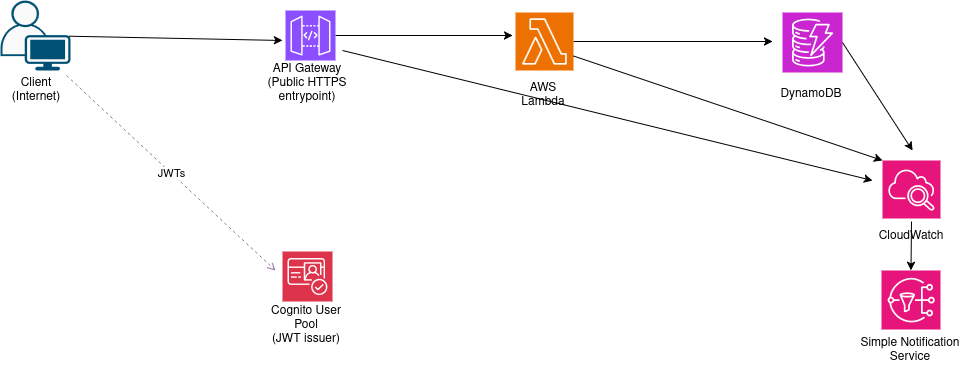

# Architecture

This project is a serverless Orders API built on AWS. It exposes a small REST-style API for creating, listing, retrieving, and cancelling orders.

The backend application is implemented in Java 21 and deployed as an AWS Lambda function. The infrastructure is defined using AWS CDK in TypeScript.

## High-level overview

At a high level, the system consists of:

- a public API endpoint exposed by API Gateway HTTP API;
- a Cognito User Pool used for JWT authentication;
- a Java Lambda function handling Orders API requests;
- a DynamoDB database;
- CloudWatch logs, metrics, and alarms for observability.

## Request flow

### Authentication Flow
1. The client authenticates with Amazon Cognito.
2. Cognito returns a JWT access token.
3. The client includes the token in requests:

   `Authorization: Bearer <JWT>`

### API Request Flow
1. The client calls API Gateway and passes the token in the `Authorization` header.
2. API Gateway validates the JWT using the Cognito authorizer.
3. If the token is valid, API Gateway invokes the Java Lambda function.
4. The Lambda function converts the API Gateway event into an internal HTTP request model.
5. The in-application router dispatches the request to the appropriate service method.
6. The service layer applies business rules.
7. The repository layer performs operations against a DynamoDB database.
8. The Lambda function returns a JSON response through API Gateway.

### Observability Flow
- Lambda application logs → CloudWatch Logs
- API Gateway access logs → CloudWatch Logs
- Lambda, API Gateway, and DynamoDB metrics → CloudWatch Metrics
- CloudWatch alarms → SNS topic / optional email notification

## Runtime architecture diagram


## Main Runtime Components

### API Gateway HTTP API
Amazon API Gateway HTTP API is the public entry point for the application.

It is responsible for:
- exposing the Orders API endpoints;
- receiving client HTTP requests;
- validating Cognito JWT tokens;
- invoking the Lambda backend;
- writing structured access logs to CloudWatch Logs.

The API uses a Cognito user pool authorizer, so unauthenticated requests are rejected before reaching the Lambda function.

The API routes are configured as catch-all routes and the Java Lambda application performs the internal routing.

### Amazon Cognito

Amazon Cognito provides authentication for the API.

The project uses:
- a Cognito User Pool;
- a User Pool Client;
- JWT-based authentication;
- API Gateway Cognito authorizer integration.

Users are created by the account owner. Self sign-up is disabled.

The Lambda application does not validate JWTs directly. Token validation happens at the API Gateway layer.

### AWS Lambda

The Orders API backend is implemented as a Java 21 AWS Lambda function.

The Lambda function is responsible for:
- receiving API Gateway HTTP API events;
- adapting API Gateway events into internal request objects;
- routing requests to the correct handler logic;
- applying business rules through the service layer;
- accessing the database through the repository layer;
- returning API Gateway-compatible HTTP responses.

SnapStart is enabled for published Lambda versions to improve Java cold-start behavior.

Reserved concurrency is configured to protect the database layer from uncontrolled traffic spikes.


## Application Architecture

The Java Lambda application is structured into small layers.

```
OrdersApiHandler
  -> ApiGatewayV2HttpAdapter
  -> Router
  -> OrderService
  -> OrderRepository
  -> DynamoDB
```

### Handler Layer

The `OrdersApiHandler` class is the Lambda entry point.

It implements the `RequestHandler<APIGatewayV2HTTPEvent, APIGatewayV2HTTPResponse>` interface.

Its responsibilities are:
- receive the Lambda invocation event;
- convert the event into an internal HTTP request;
- delegate routing to the Router;
- convert the internal HTTP response back into an API Gateway response;
- handle unexpected errors safely.

### Adapter Layer

The `ApiGatewayV2HttpAdapter` converts between AWS-specific API Gateway objects and application-specific HTTP DTOs.

It handles:
- HTTP method extraction;
- path extraction;
- query string extraction;
- plain and Base64-encoded request bodies;
- JSON serialization of response bodies.

This keeps most of the application independent from API Gateway-specific classes.

### Routing Layer

The `Router` performs lightweight in-application routing.

It supports the following endpoints:

| Method | Path                  | Description             |
|--------|-----------------------|-------------------------|
| `POST` | `/orders`             | Create a new order      |
| `GET`  | `/orders`             | List orders             |
| `GET`  | `/orders/{id}`        | Retrieve an order by ID |
| `PUT`  | `/orders/{id}/cancel` | Cancel an order         |

The router is also responsible for:
- parsing request bodies;
- parsing query parameters;
- mapping service exceptions to HTTP responses;
- returning consistent JSON error responses.

List operations use DynamoDB global secondary indexes and are eventually consistent. Reads by order ID use a strongly consistent read.

### Service Layer

The `OrderService` contains business logic.

The service layer keeps business rules separate from DynamoDB and HTTP-specific concerns.

### Repository Layer

The `OrderRepository` contains DynamoDB-based database access.

It performs DynamoDB operations for:
- creating orders;
- finding orders by ID;
- listing orders with optional status filtering;
- cancelling orders.

Order cancellation is idempotent. If an order is already cancelled, cancelling it again returns the existing cancelled order without modifying it.

## DynamoDB access patterns

The Orders table supports the following access patterns:

| Access pattern        | DynamoDB operation                       |
|-----------------------|------------------------------------------|
| Create order          | `PutItem` with conditional expression    |
| Get order by ID       | `GetItem` on table primary key           |
| List all orders       | `Query` on `GSI2`                        |
| List orders by status | `Query` on `GSI1`                        |
| Cancel order          | `UpdateItem` with conditional expression |

## Infrastructure Architecture

The infrastructure is split into several AWS CDK stacks.

### DynamoDB Stack

The DynamoDB stack creates the Orders table.

The table uses:
- `pk` as the partition key;
- `sk` as the sort key;
- `GSI1` for listing orders by status;
- `GSI2` for listing all orders by creation time;
- on-demand billing.

The table stores order records and supports create, retrieve, list, and cancel operations.


### Lambda Stack

The Lambda stack creates:
- the Java Lambda function;
- the Lambda alias used by API Gateway;
- the `ORDERS_TABLE_NAME` environment variable;
- IAM permissions for the Lambda function to read and write the DynamoDB table;
- CloudWatch log retention settings.

The Lambda function is not deployed into a VPC. It accesses DynamoDB directly through the AWS SDK using IAM permissions granted by the CDK stack.

### Cognito Stack

The Cognito stack creates:
- a Cognito User Pool;
- a User Pool Client;
- CloudFormation outputs for testing and authentication.

The User Pool is configured with email-based sign-in. Self sign-up is disabled.

### API Stack

The API stack creates:
- an API Gateway HTTP API;
- a Lambda integration;
- a Cognito user pool authorizer;
- a default stage;
- API Gateway access logs.

The API uses a catch-all route and delegates application routing to the Java Lambda function.

### Monitoring Stack

The monitoring stack creates:
- an SNS topic for alarm notifications;
- optional email subscription for alarm notifications;
- CloudWatch alarms for Lambda;
- CloudWatch alarms for API Gateway;
- CloudWatch alarms for DynamoDB.

This stack provides operational visibility into the main runtime and data components.


## Observability

The system uses CloudWatch for logs, metrics, and alarms.

### Logs

The project writes the following logs:
- Lambda application logs;
- API Gateway HTTP API access logs;

### Metrics and alarms

The monitoring stack includes alarms for:
- Lambda errors;
- Lambda throttles;
- Lambda p95 duration;
- Lambda concurrent executions near reserved concurrency limit;
- API Gateway 4xx error rate;
- API Gateway 5xx error rate;
- API Gateway p95 latency;
- API Gateway integration p95 latency;
- DynamoDB throttled requests;
- DynamoDB system errors.

Distributed tracing with AWS X-Ray, OpenTelemetry, or ADOT is not currently configured.


## Deployment Architecture

Deployment is split across multiple CDK stacks:

```
OrdersApp-DynamoDB
OrdersApp-Lambda
OrdersApp-Cognito
OrdersApp-Api
OrdersApp-Monitoring
```


## Design Highlights

### Serverless API Backend

The API backend uses AWS Lambda instead of a long-running application server.

This reduces infrastructure management and fits the request-driven nature of the application.

### API Gateway HTTP API

The project uses API Gateway HTTP API as a lightweight API entry point.

HTTP API is a good fit for simple REST-style APIs with Lambda integration and JWT authorization.

### Cognito Authorization at the Edge of the Application

JWT validation is handled by API Gateway using Cognito.

This keeps authentication concerns out of the Java business logic and prevents unauthorized requests from reaching the Lambda function.

### Focused CDK Stacks

Infrastructure is split into focused stacks.

This makes the system easier to understand, deploy, and document.

## Future Architecture Improvements

Potential improvements include:
- add CI/CD with GitHub Actions;
- add separate dev, staging, and production environments;
- add custom domain and TLS certificate for API Gateway;
- add AWS WAF in front of API Gateway;
- add Lambda deployment safety with canary or linear deployments;
- enable AWS X-Ray or OpenTelemetry-based tracing;
- add structured JSON application logging;
- improve request validation and error response consistency;
- add OpenAPI documentation;
- enable DynamoDB deletion protection for production;
- use production-safe removal policies;
- add database backup and restore runbooks;
- tune Lambda memory, timeout, concurrency, and DynamoDB access patterns based on observed load;
- add idempotency keys for order creation;
- add route-level authorization scopes and user/tenant ownership checks.

