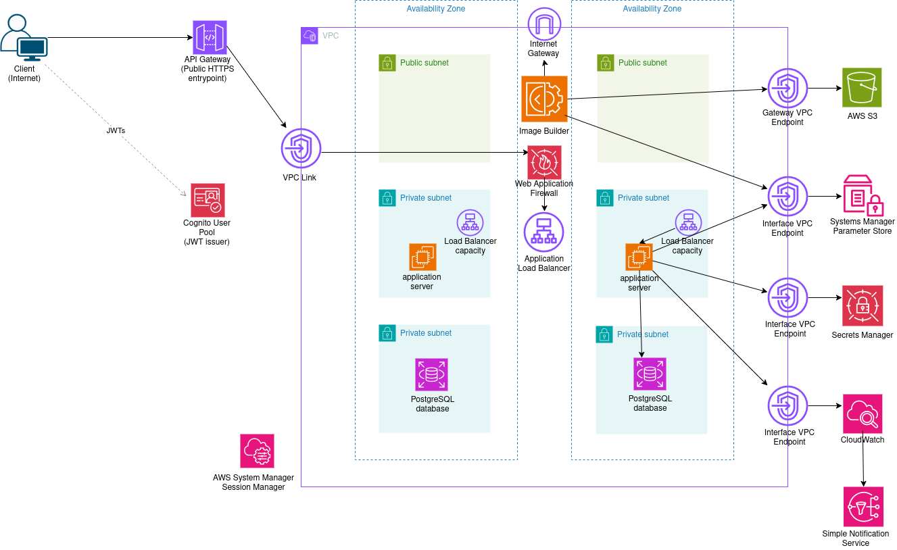
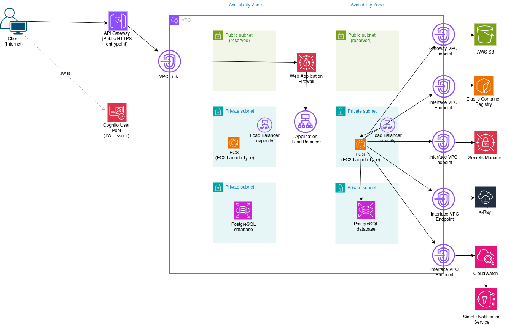

# order-management-aws-architectures
An order management app deployed on AWS, using 4 different architectures.

# Architecture 1: deployed on EC2 using AMI.

The application runs on EC2 instances.

Architecture diagram:

All details can be found in the project folder: [01-ec2-ami](01-ec2-ami)

---

# Architecture 2: Deployed on ECS using the EC2 launch type.

The application runs on ECS with EC2 Launch Type.

Architecture diagram:

All details can be found in the project folder: [02-ecs-ec2](02-ecs-ec2)

# Architecture 3: Deployed on ECS using the Fargate launch type.

# Architecture 4: Serverless architecture.
